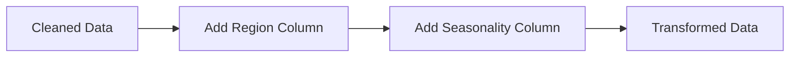
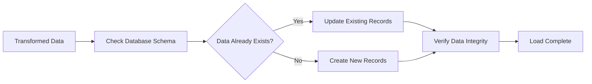

# Hamza – Capstone Project

## Project Plan

### Choosing an API
I have decided to choose the Spotify API for extracting data and performing analysis to gain insights. Some initial ideas for insights include:
- Compare the most popular genres in different regions (visualize with a heatmap).
- Visualize how genres have changed over time (line graph).
- Visualize the seasonality of genres and how they shift (e.g., upbeat in summer, moodier in winter).
- Check if seasonal trends are mirrored in Australia.
- Compare global trends to local trends.
- Analyze how user taste has transitioned over time, if specific user data is available.

---

### Extract

**Spotify API Documentation**: [Spotify API Documentation](https://developer.spotify.com/documentation/web-api)

#### Endpoints to Use:
- `GET tracks (id)` – Metadata for a specific track.
- `GET audio-features` – Audio analysis (e.g., tempo, danceability).
- `GET playlists` – Metadata and tracks from a playlist (e.g., UK Top 50).
- `GET users (userID)` – Public profile information about a user.
- `GET browse categories` – Categories for playlists.

#### Plan:
- Start with retrieving the top 100 tracks from Spotify’s "Top 100 {region}" playlists for each region.
- Retrieve data for each year since 2010.

---

### Transform

#### Data Cleaning Steps:
1. Standardize genre names (e.g., `hip hop` -> `Hip-Hop`, `pop` -> `Pop`).
2. Standardize song names (e.g., remove features from titles or fix anomalies).
3. Remove duplicate tracks from multiple playlists.
4. Handle missing values (e.g., remove rows with missing data).

#### New Columns:
- **Region** – Identify the region where the song is most popular.
- **Seasonality Tags** – Determine the season when the song was released.

---

### Load

- Load the data into the Pagilla database after verifying if it is already present.
- If the data already exists, update the table instead.

---

### Analyse

- Show different visualizations with filters, such as:
  - **Popular Genres in Different Regions**:
    - Heatmap with filters to switch between global and regional views.
  - **Genre Popularity Over Time**:
    - Line graph showing trends over time.
  - **Seasonality of Genres**:
    - Visualize how genres shift seasonally.

---

## Project Requirements

### Goal
Build an ETL pipeline to extract track data from Spotify into a cleaned database for analysis using Streamlit.

### Data Sources
1. **Spotify’s API**:
   - Top 100 Regional playlists.
   - Track metadata.
   - Audio features (e.g., tempo, danceability).
   - Historical playlist data.

### Challenges
1. **Data Volume**:
   - Thousands of tracks each year across multiple regions.
   - Overlapping data (e.g., songs appearing in multiple playlists/regions).
2. **Data Quality**:
   - Inconsistent or missing genre metadata.
   - Duplicate tracks.
   - Time data may be inaccurate (e.g., songs gaining popularity much later than release).
3. **API Limitation**:
   - Spotify API rate limits must be handled.

### Outcome
Produce a cleaned and enriched dataset for analysis.

---

## Requirements Summary

1. Ensure access to the Spotify API for data extraction.
2. Consolidate and clean data for analysis.
3. Enable analysis of genre popularity across regions and seasons.
4. Facilitate comparison of global vs. local trends.

---

## User Stories

1. **As a Data Analyst**, I want access to a single, clean, and accurate dataset containing metadata about songs so that I can perform analysis without worrying about inconsistencies.
2. **As a Data Analyst**, I want to know the most popular songs in each region.
3. **As a Data Analyst**, I want historical data on the most popular songs from 2010 onwards.
4. **As a Business Stakeholder**, I want to see which genres of music are most popular in each region during each season.
5. **As a Data Scientist**, I want the cleaned and enriched data stored in an SQL table so that I can query it directly.
6. **As a Data Scientist**, I want to refresh the dataset with new data regularly to keep the analysis up to date.

---

## Definition of Done

### Extraction
- [ ] Spotify API connection is successfully established.
- [ ] Top 100 tracks from each region’s playlist are fetched.
- [ ] Historical playlist data from 2010 onwards is retrieved.
- [ ] Metadata for each track (e.g., tempo, danceability) is fetched.

### Cleaning
- [ ] All duplicate tracks are removed.
- [ ] Inconsistent genre names are standardized.

### Transform
- [ ] New column for the most popular region is added.
- [ ] New column for seasons is added.
- [ ] Any additional columns are added.

### Load
- [ ] A SQL database is created with the correct schema.
- [ ] All cleaned and transformed data is loaded successfully.

### Analysis
- [ ] Streamlit app is created and published.
- [ ] Heatmaps are created to show genre popularity in each region.
- [ ] Line graph is created to show genre popularity over time.
- [ ] Seasonal trend comparisons are visualised.
- [ ] Filters are added to visualisations to make them more interactive.

---
## Flowcharts
### High Level Flowchart
```mermaid
flowchart TD
    A@{ shape: stadium, label: "Start: Data Sources"} --> B@{ shape: tri, label: "Extract Data"}
    B --> C@{ shape: cyl, label: "Source: Spotify Web API"}
    C --> D[Data Cleaning]
    D --> E[Data Transformation]
    E --> F[Load Transformed Data]
    F --> G[Analyse Data]
    G --> H([Publish Streamlit])
 ```
 ### Data Cleaning Subprocesses
 ```mermaid
 flowchart LR
    A[Data Cleaning*] --> B1@{shape: subproc, label: "Remove Duplicates"}
    B1 --> B2@{shape: subproc, label: "Handle Missing Values"}
    B2 --> B3@{shape: subproc, label: "Standardize Formats"}
    B3 --> B4@{ shape: lean-r, label: "Cleaned Data" }
```
 ### Data Transformation Subprocesses

 ### Loading Subprocesses

